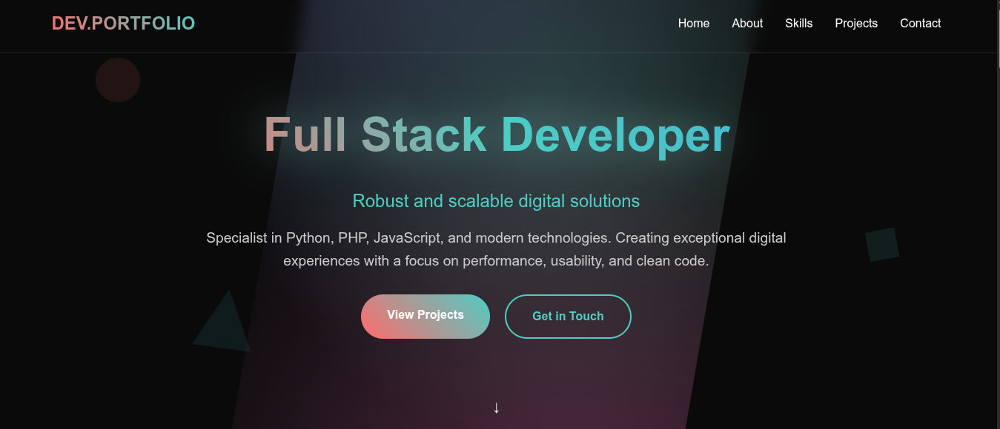

# Developer Portfolio

A modern, responsive portfolio website showcasing full-stack development skills and projects. Built with vanilla HTML, CSS, and JavaScript, featuring smooth animations, parallax effects, and a sleek dark theme.



## 🌟 Features

- **Responsive Design**: Fully responsive layout that works seamlessly across all devices
- **Dark Theme**: Modern dark aesthetic with gradient accents
- **Smooth Animations**: Scroll-triggered animations and smooth transitions
- **Parallax Effects**: Dynamic floating shapes and parallax scrolling
- **Interactive Navigation**: Active section highlighting and smooth scrolling
- **Mobile Menu**: Collapsible navigation for mobile devices
- **Back to Top Button**: Quick navigation back to the top of the page
- **Professional Sections**:
  - Hero section with typing effect
  - About section with animated statistics
  - Skills showcase with categorized technologies
  - Featured projects with live links
  - Contact information with social links

## 🚀 Live Demo

Visit the live portfolio: <https://michelfviana.github.io/portfolio/>

## 📂 Project Structure

```txt
portfolio/
├── index.html          # Main HTML structure
├── styles.css          # All CSS styles and animations
├── script.js           # JavaScript functionality
└── README.md           # Project documentation
```

## 🛠️ Technologies Used

- **Frontend**: HTML5, CSS3, JavaScript (ES6+)
- **Icons**: Font Awesome
- **Animations**: CSS Keyframes, Intersection Observer API
- **Effects**: CSS Backdrop Filter, CSS Gradients
- **Features**: Responsive Grid, Flexbox, CSS Custom Properties

## ⚙️ Installation & Setup

1. **Clone the repository**

   ```bash
   git clone https://github.com/yourusername/portfolio.git
   cd portfolio
   ```

2. **Open in browser**

   ```bash
   # Option 1: Direct file opening
   open index.html
   ```

## 🎨 Customization

### Personal Information

Update the following sections in [`index.html`](index.html):

- **Meta tags**: Update name, description, and social media URLs
- **Hero section**: Modify title, subtitle, and description
- **About section**: Update statistics and personal description
- **Skills section**: Add/modify your technical skills
- **Projects section**: Replace with your own projects
- **Contact section**: Update social media links and contact information

### Styling

Modify [`styles.css`](styles.css) to customize:

- **Color scheme**: Update CSS custom properties for colors
- **Typography**: Change font families and sizes
- **Animations**: Adjust timing and effects
- **Layout**: Modify grid and flexbox properties

### Functionality

Enhance [`script.js`](script.js) to add:

- **Form handling**: Add contact form functionality
- **Additional animations**: Create new scroll-triggered effects
- **API integration**: Connect to external services
- **Analytics**: Add tracking and metrics

## 🔧 Key Features Implementation

### Smooth Scrolling Navigation

```javascript
// Smooth scrolling for anchor links
document.querySelectorAll('a[href^="#"]').forEach(anchor => {
    anchor.addEventListener('click', function (e) {
        e.preventDefault();
        const target = document.querySelector(this.getAttribute('href'));
        if (target) {
            target.scrollIntoView({
                behavior: 'smooth',
                block: 'start'
            });
        }
    });
});
```

### Scroll-Triggered Animations

```javascript
// Intersection Observer for scroll animations
const observer = new IntersectionObserver((entries) => {
    entries.forEach(entry => {
        if (entry.isIntersecting) {
            entry.target.style.opacity = '1';
            entry.target.style.transform = 'translateY(0)';
        }
    });
}, observerOptions);
```

### Parallax Effects

```javascript
// Parallax effect for floating shapes
window.addEventListener('scroll', () => {
    const scrolled = window.pageYOffset;
    const shapes = document.querySelectorAll('.shape');
    shapes.forEach((shape, index) => {
        const speed = (index + 1) * 0.5;
        shape.style.transform = `translateY(${scrolled * speed}px)`;
    });
});
```

## 📱 Responsive Design

The portfolio is fully responsive with breakpoints for:

- **Desktop**: 1200px and above
- **Tablet**: 768px to 1199px
- **Mobile**: Below 768px

Key responsive features:

- Collapsible mobile navigation
- Flexible grid layouts
- Scalable typography
- Touch-friendly interactions

## 🎯 Performance Optimizations

- **CSS Grid and Flexbox**: Efficient layouts without JavaScript
- **CSS Transforms**: Hardware-accelerated animations
- **Intersection Observer**: Efficient scroll-based animations
- **Minimal Dependencies**: Only Font Awesome for icons
- **Optimized Images**: Responsive image handling

## 🌐 Browser Support

- Chrome 60+
- Firefox 55+
- Safari 12+
- Edge 79+

## 📄 License

This project is open source and available under the [MIT License](LICENSE).

## 🤝 Contributing

1. Fork the project
2. Create your feature branch (`git checkout -b feature/AmazingFeature`)
3. Commit your changes (`git commit -m 'Add some AmazingFeature'`)
4. Push to the branch (`git push origin feature/AmazingFeature`)
5. Open a Pull Request

## 📞 Contact

**Michel Ferreira** - Full Stack Developer

- Email: [michel.fvc@proton.me](mailto:michel.fvc@proton.me)
- LinkedIn: [Michel Ferreira](https://www.linkedin.com/in/michel-ferreira-429b17225/)
- GitHub: [@michelfviana](https://github.com/michelfviana)
- WhatsApp: [+55 19 97103-2254](https://wa.me/5519971032254)

## 🙏 Acknowledgments

- Font Awesome for the beautiful icons
- Inspiration from modern web design trends
- The developer community for continuous learning and improvement

---

⭐ **If you found this portfolio helpful, please give it a star!**
