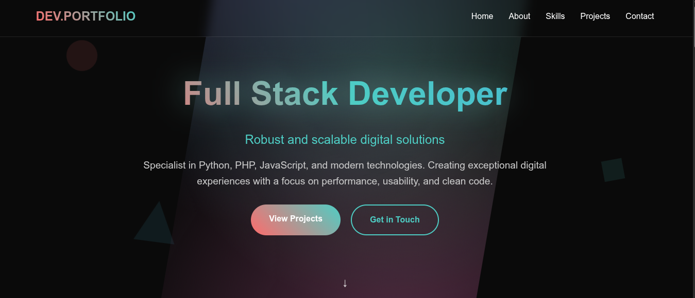

# Michel Ferreira — Software Engineer Portfolio

A dark terminal-inspired portfolio website built with vanilla HTML, CSS, and JavaScript. Designed with a CryptoWatch-style aesthetic featuring a real-time scrolling ticker, typewriter effects, animated stats, and a full professional profile.



## Live Demo

[michelfviana.github.io/portfolio](https://michelfviana.github.io/portfolio/)

## About

This portfolio showcases my professional background as a Software Engineer currently working at **Total Express** (via Leega) — Brazil's largest private e-commerce logistics operation. It covers my work history, technical stack, projects, education, and certifications.

## Features

- **CryptoWatch-inspired design** — dark terminal palette (neon green, teal, amber) with CSS grid overlay
- **Live scrolling ticker** — real-time-style bar cycling through tech stack items
- **Typewriter terminal** — cycling command-line animation in the hero
- **Scroll-reveal animations** — Intersection Observer-powered fade-ups throughout
- **Animated counters** — stats counting up on scroll into view
- **Certification filter** — filterable grid by category (Security, Cloud, Languages, Data & AI, English)
- **Full work history timeline** — all 5 companies with tech tags and live indicator for current role
- **Responsive** — mobile-friendly with collapsible navigation
- **Zero dependencies** — only Font Awesome and Google Fonts, no frameworks

## Project Structure

```text
portfolio/
├── index.html      # Full HTML structure (all sections)
├── styles.css      # CryptoWatch-inspired styles and animations
├── script.js       # Typewriter, counters, scroll reveal, cert filter
└── README.md
```

## Sections

| Section       | Content                                                                              |
| ------------- | ------------------------------------------------------------------------------------ |
| Hero          | Name, title, terminal typewriter, profile JSON window                                |
| About         | 3 professional pillars, animated stat counters                                       |
| Experience    | Timeline with 5 roles (Total Express, AgattiTech, Gov Rondônia, Before, Energisa)   |
| Skills        | Heatmap grid across 8 categories with proficiency levels                             |
| Projects      | 7 projects (CryptoWatch, PIC-1, Intelligent Agent, Wine SVM, IPS v2, AI Chat, MiniLang) |
| Education     | Degree, English certification, achievements (3rd place Ideathon SP 2025)             |
| Certifications| 20+ certs filterable by category                                                     |
| Contact       | Email, LinkedIn, GitHub, WhatsApp                                                    |

## Tech Stack

- HTML5, CSS3, JavaScript (ES6+)
- Google Fonts: Inter + JetBrains Mono
- Font Awesome 6
- CSS custom properties, Grid, Flexbox, Intersection Observer API

## Responsive Breakpoints

- Desktop: 1100px+
- Tablet: 768px – 1100px
- Mobile: below 768px

## Running Locally

```bash
git clone https://github.com/Michelfviana/portfolio.git
cd portfolio
# Open index.html directly in any browser
```

No build step or dependencies to install.

## Contact

**Michel Ferreira** — Software Engineer

- Email: [michel.fvc@proton.me](mailto:michel.fvc@proton.me)
- LinkedIn: [michel-ferreira-429b17225](https://www.linkedin.com/in/michel-ferreira-429b17225/)
- GitHub: [@michelfviana](https://github.com/michelfviana)
- WhatsApp: [+55 19 97103-2254](https://wa.me/5519971032254)

---

MIT License
